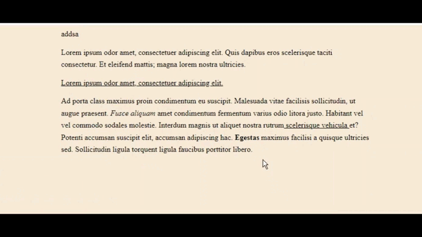

# EditorJS Multiblock Selection Plugin

[EditorJS](https://editorjs.io) plugin to help extend your inline tools functionality with multi-block selection



### Install via NPM

```shell
npm i editorjs-multiblock-selection-plugin
```

## Usage

#### 1. Use the plugin after you instantiated your editor

```js
import EditorJS from '@editorjs/editorjs'
import MultiBlockSelectionPlugin from 'editorjs-multiblock-selection-plugin'

// ... create your editor with config ...

const blockSelection = new MultiBlockSelectionPlugin({ editor, version: EditorJS.version })
editor.isReady.then(() => {
    blockSelection.listen()
})
```

#### 2. Listen to the plugins selected select block change event to sync the selected blocks

```js
let selectedBlocks = []
window.addEventListener(MultiBlockSelectionPlugin.SELECTION_CHANGE_EVENT, (ev) => {
    selectedBlocks = ev.detail.selectedBlocks.slice()
})
```

#### 3. Extend your basic inline tools

Here is an example:

```js
// extending @editorjs/underline
class ExtendedUnderline extends Underline {
    elementTagName = 'u'

    surround(range) {
        if (!selectedBlocks.length) {
            super.surround(range)
            return
        }
        let isAppliedOnAllSelectedBlocks = true
        // verify if it is applied to all selected blocks
        selectedBlocks.forEach(({ blockId, index }) => {
            const el = document.querySelector(`.codex-editor__redactor .ce-block:nth-child(${index + 1})`)
            if (!(el instanceof HTMLElement)) return

            const textEl = el.querySelector('[contenteditable=true]')
            if (!(textEl instanceof HTMLElement)) return
            const allText = el.textContent

            const firstBoldEl = textEl.querySelector(this.elementTagName)
            const isAppliedOnCurrentBlock = firstBoldEl && firstBoldEl.textContent == allText

            if (isAppliedOnCurrentBlock) return
            isAppliedOnAllSelectedBlocks = false
        })

        selectedBlocks.forEach(({ blockId, index }) => {
            // depending on your editor version you might have to use getByIndex();
            const block = this.api.blocks.getById(blockId)
            if (!block) return

            const el = block.holder
            if (!(el instanceof HTMLElement)) return

            const textEl = el.querySelector('[contenteditable=true]')
            if (!(textEl instanceof HTMLElement)) return
            const allText = el.textContent

            const firstUnderlineEl = textEl.querySelector(this.elementTagName)
            const isAppliedOnCurrentBlock = firstUnderlineEl && firstUnderlineEl.textContent == allText
            const shouldRemove = isAppliedOnAllSelectedBlocks
            const shouldAdd = !isAppliedOnAllSelectedBlocks && !isAppliedOnCurrentBlock

            if (shouldRemove) {
                textEl.querySelectorAll(this.elementTagName).forEach((b) => b.replaceWith(...b.childNodes))
                block.dispatchChange()
                return
            }

            if (!shouldAdd) return

            textEl.querySelectorAll(this.elementTagName).forEach((b) => b.replaceWith(...b.childNodes))

            const newUnderline = document.createElement(this.elementTagName)
            newUnderline.append(...textEl.childNodes)

            textEl.replaceChildren(newUnderline)
            block.dispatchChange()
        })
    }
}
```

Other examples can be found [here](https://github.com/sebmeister2077/editorjs-multiblock-selection-plugin/tree/main/examples)

## Working versions of EditorJS

-   v2.20 to v2.30.7 have been verified to work
